<!-- ========================================================= -->
<!--                       PROFILE HEADER                       -->
<!-- ========================================================= -->

# 👋 Hi, I'm Disha Mallick

### Full-Stack Developer • AI/ML Enthusiast 

  
  
  

---

<!-- ========================================================= -->
<!--                  ANIMATED PROFILE                         -->
<!-- ========================================================= -->

<table>
<tr>
<td width="60%" valign="top">

</td>

<td width="40%" valign="top">

</td>
</tr>
</table>

---
# 🚀 Featured Projects

| 🌸 **Sakhi**                                                 | 🧠 **NEXORA AI**                     | 🤖 **SAIL-ML**                  | 🌐 **Portfolio**                    |
| ------------------------------------------------------------ | ------------------------------------ | ------------------------------- | ----------------------------------- |
| **Women Empowerment Platform**                               | **AI-Powered Intelligent System**    | **Machine Learning Project**    | **Developer Portfolio**             |
| 🟢 Live                                       | 🟢 **Working On**                    | 🟡 Developing                   | 🟢 Live                             |
| Safety • Career • Jobs • Mentorship                          | AI • ML • Intelligent Systems        | ML • Data • Models              | Projects • Skills • Achievements    |
| `React` `Tailwind` `Node.js` `Express` `Prisma` `PostgreSQL` | `Python` `AI` `ML` `Data Processing` | `Python` `ML` `Data Processing` | `React` `JavaScript` `CSS` `Vercel` |

## 🛠️ TECHNICAL ARSENAL

<table> <tr>

<td width="50%" valign="top">

## 💻 Languages

Python JavaScript TypeScript
HTML CSS

## 🎨 Frontend

React Tailwind CSS
Responsive UI Design

## ⚙️ Backend

Flask Node.js
REST APIs Prisma

</td>

<td width="50%" valign="top">

## 🤖 AI / ML

Machine Learning Computer Vision
OpenCV YOLO

## 🗄️ Database

MySQL PostgreSQL

🔧 Tools & Platforms

Git GitHub VS Code Vercel

</td>

</tr> </table>

📊 Analytics & Activity

  

  

# ☕ Developer Activity

| ☕ Coffee Consumed | 🐛 Bugs Fixed |    🚀 Deployments   |
| :---------------: | :-----------: | :-----------------: |
|   **127+ cups**   |  **500+ bugs** | **10+ deployments** |

**☕ Code → 🐛 Debug → 🚀 Deploy → 🔁 Repeat**

# 🏆 Achievements & Certifications

### 📜 Certifications • 🏅 Hackathons • 🚀 Technical Milestones

A collection of my certifications, hackathon participation and technical achievements gathered throughout my learning and development journey.

### 📜 Certifications

| Certification | |
|---|---|
| 🏅 **78th Independence Day ceremonial parade** | 
| 🏅 **3rd in photography in NSS Wing** |
| 🏅 **2nd in memory race, sports committee** |
| 🏅 **Fit in Deutsch - German certification, level 1** |
| 🏅 **AWS Certified Solutions by Forage** |

### 🏅 Hackathons & Competitions

| Event | Achievement / Participation | Project |
|---|---| ---|
| 🚀 **Pantheon Techfest'25** |  Participant @BIT MESRA, RANCHI | Traffic Ops+ - smart traffic management system(prototype)

---

# 💼 Open to Opportunities

I'm currently open to opportunities where I can **learn, contribute and grow as a software developer**.

### Interested In

- 💼 **Software Engineering Internships**
- 🚀 **Full-Stack Development Roles**
- 🤖 **AI / ML Opportunities**
- 💻 **Web Development Projects**
- 🤝 **Open-Source Collaboration**
- 🧠 **Technical Projects & Hackathons**
- 🌱 **Learning & Mentorship Opportunities**

I'm especially interested in opportunities where I can work on **real-world products, solve meaningful problems and collaborate with other developers.**

---

# ⚡ BUILD • LEARN • CREATE • SHIP

 

  

**Thanks for visiting my profile!**

 

Made with curiosity, code and a continuous desire to learn.

  

© 2026 Disha Mallick • Keep Building 🚀

   ↓
Future AI-powered features
